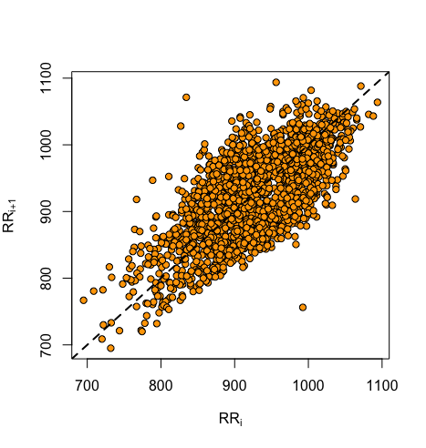

<!-- README.md is generated from README.Rmd. Please edit that file -->

```{r, echo = FALSE}
knitr::opts_chunk$set(
  collapse = TRUE,
  comment = "#>",
  fig.path = "README-"
)
```

# hrvhra

The goal of hrvhra is to provide functions to calculate the most often used, time domain, variance- and runs-based HRV and HRA descriptors, as well as draw the Poincare plot and assess the quality of your RR-intervals time series based on the annotations vector. All you need is your RR-intervals time series, prefferably with the annotations (i.e. the annotations for each RR interval). The annotations should be as follows: 0-beat of sinus origin, 1-beat of ventricular origin, 2-beat of supraventricular origin, 3-artifact. Any annotation which is not one of these 4 values will be assigned the "unknown" label. 

## Installation

You can install hrvhra from github with:

```{r gh-installation, eval = FALSE}
# install.packages("devtools")
devtools::install_github("jaropis/hrvhra")
```

## Examples

These are a few basic examples showing the functionality of the package. The package contains an example dataset `RR`, which is a dataframe with `RR` (RR-intervals) and `flags` (annotations) columns. This dataset will be used in the examples below.

#### Calculate variance based HRV and HRA descriptors

```{r example1}
library(hrvhra)
hrvhra(RR$RR, RR$flags)
```

#### Plot the Poincare plot
```{r example2, eval=FALSE}
drawpp(RR$RR, RR$flags)
```

```{r example3_fig, echo=FALSE}

```

#### Check the quality of your RR-intervals time series based on the annotations

```{r example3}
describerr(RR$flags)
```

#### Count the monotonic runs in your RR-intervals time series

```{r example4}
countruns(RR$RR, RR$flags)
```

## References
J Piskorski, P Guzik, Geometry of the Poincaré plot of RR intervals and its asymmetry in healthy adults, Physiological measurement 28 (3), 287 (2007)

J Piskorski, P Guzik, The structure of heart rate asymmetry: deceleration and acceleration runs, Physiological measurement 32 (8), (2011)
