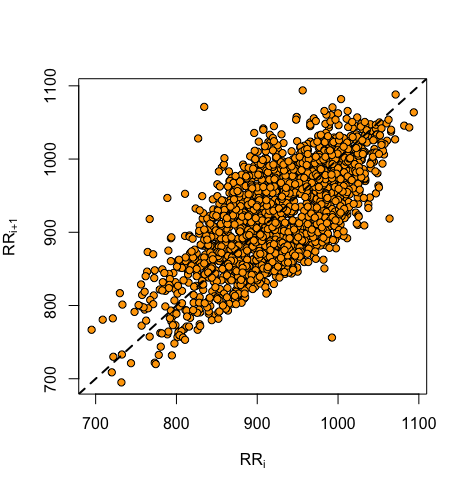

<!-- README.md is generated from README.Rmd. Please edit that file -->
hrvhra
======

The goal of hrvhra is to provide functions to calculate the most often used, time domain, variance- and runs-based HRV and HRA descriptors, as well as draw the Poincare plot and assess the quality of your RR-intervals time series based on the annotations vector. All you need is your RR-intervals time series, prefferably with the annotations (i.e. the annotations for each RR interval). The annotations should be as follows: 0-beat of sinus origin, 1-beat of ventricular origin, 2-beat of supraventricular origin, 3-artifact. Any annotation which is not one of these 4 values will be assigned the "unknown" label.

Installation
------------

You can install hrvhra from github with:

``` r
# install.packages("devtools")
devtools::install_github("jaropis/hrvhra")
```

Examples
--------

These are a few basic examples showing the functionality of the package. The package contains an example dataset `RR`, which is a dataframe with `RR` (RR-intervals) and `flags` (annotations) columns. This dataset will be used in the examples below.

#### Calculate variance based HRV and HRA descriptors

``` r
library(hrvhra)
hrvhra(RR$RR, RR$flags)
#>     SDNN      SD1      SD2     SD1I    SDNNd    SDNNa     SD1d     SD1a 
#> 66.31092 36.80717 86.25258 36.80717 45.94416 47.81497 26.41755 25.62968 
#>     SD2d     SD2a 
#> 59.36199 62.57526
```

#### Plot the Poincare plot

``` r
drawpp(RR$RR, RR$flags)
```




#### Check the quality of your RR-intervals time series based on the annotations

``` r
describerr(RR$flags)
#>  all    N    V    S    X    U 
#> 1943 1943    0    0    0    0
```

#### Count the monotonic runs in your RR-intervals time series

``` r
countruns(RR$RR, RR$flags)
#> $direction_up
#> up1 up2 up3 up4 up5 
#>  61 173 134  37   2 
#> 
#> $direction_down
#> down1 down2 down3 down4 down5 down6 down7 
#>    64   180   127    27     5     3     2 
#> 
#> $no_change
#> no_change1 
#>          6
```

References
----------

J Piskorski, P Guzik, Geometry of the Poincaré plot of RR intervals and its asymmetry in healthy adults, Physiological measurement 28 (3), 287 (2007)

J Piskorski, P Guzik, The structure of heart rate asymmetry: deceleration and acceleration runs, Physiological measurement 32 (8), (2011)
